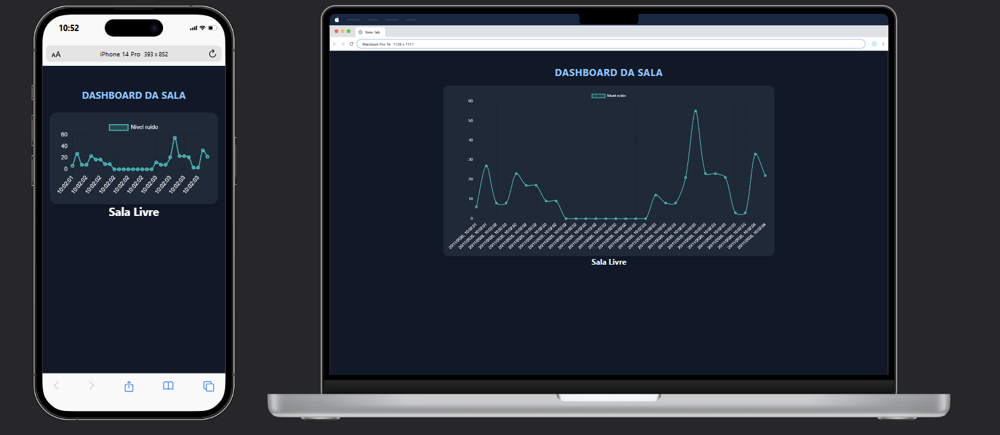

# SenseRoom
---
## Autores
- Antônio Jacinto de Andrade Neto (RM: 561777)
- Felipe Bicaletto (RM: 563524)
- Thayná Pereira Simões (RM: 566456)
---
## Descrição do projeto
Este projeto implementa um sistema de monitoramento inteligente de ambientes utilizando um ESP32, sensor PIR e microfone analógico para detectar presença e níveis de ruído em tempo real. Os dados são enviados via MQTT para plataformas IoT, permitindo integração com dashboards, sites ou aplicativos internos.

A solução foi pensada para resolver um problema comum em grandes empresas: a dificuldade de encontrar salas disponíveis e silenciosas para reuniões, foco ou gravações. Com a detecção automática de ocupação e ruído, a empresa passa a ter um mapa atualizado dos ambientes, permitindo que funcionários verifiquem rapidamente qual sala está vazia, silenciosa ou indisponível.

Ao facilitar o acesso à informação e reduzir o tempo perdido procurando ambientes adequados, o sistema contribui diretamente para aumentar a produtividade, melhorar a organização interna e otimizar o uso dos espaços corporativos.

---
## Arquitetura do projeto


### O sistema é composto por três camadas principais:
1. **Dispositivo IoT (ESP32)** 
 - Detecta presença através do sensor PIR.
 - Mede o nível de ruído com um microfone analógico.
 - Processa os dados e publica as informações em tópicos específicos no broker MQTT.
     - presença
     - nível de ruído

2. **Broker MQTT**  
   - Recebe os dados do ESP32 e distribui para os consumidores (ex.: FIWARE IoT Agent).  
   - IP configurável (ex.: `20.118.201.114`).

3. **FIWARE / STH-Comet / Dashboards**  
   - O **FIWARE IoT Agent** consome os dados do MQTT e os armazena no **STH-Comet**
   - Um dashboard em **Python Flask** conecta-se ao STH e exibe:  
     - Salas ocupadas ou livres em tempo real
     - Nível de ruído atual
     - Histórico para análise de uso e produtividade

---

## Como funciona
- O ESP32 coleta dados de presença (via sensor PIR) e nível de ruído (via microfone analógico), processa as leituras e publica as informações em tópicos MQTT. Essas informações podem ser usadas para identificar se uma sala está ocupada e se o ambiente está silencioso ou ruidoso.
- MQTT distribui os dados para o FIWARE IoT Agent, que registra os valores históricos.
- Dashboard em Flask consulta o STH-Comet para exibir o gráfico de ruído e a presença.

Link da Simulação Wokwi: https://wokwi.com/projects/447436494310112257

---
## Manual de instalaçõ em uma VM (Ubuntu Server)
### 1️. Pré-requisitos
- Ubuntu Server LTS (20.04 ou 22.04)
- Python 3.12 (ou superior)
- Pip instalado
- Porta 5000 liberada no firewall

### 2️. Clonar o projeto
```sh
git clone https://github.com/Grupo-FIAP-Antonio-Felipe-e-Joao-Vitor/GS2-edge.git
cd GS2-edge
```

### 3. Atualize os pacotes do sistema:
```sh
sudo apt update
```

### 4. Instale o Docker e o Docker Compose:
```sh
sudo apt install docker.io
sudo apt install docker-compose
```

### 5. Suba os containers necessários para o FIWARE Descomplicado:
```sh
sudo docker-compose up -d
```

---
## Instalação e configuração do dispositivo

1. Baixe a collection do Postman disponível na pasta **docs** do repositório no GitHub.

2. Crie uma variável de ambiente chamada url e passe o IP da sua vm criada.

3. Siga os passos:
- Execute o Health Check do **Iot-Agent**, **STH-Comet** e **Orion**.
- No **Iot-Agent** provisione o Service Group e provisione o Smart Device.
- No **STH-Comet** realize o Subscribe Device
- No ESP32:
     - Altere o **SSID** para o nome da rede Wifi
     - Altere o **PASSWORD** para a senha da rede Wifi
     - Altere o **BROKER_MQTT** para o IP da sua vm

4. Visualizar dados de forma manual
- No **Iot-Agent**:
     - Execute o **Result of presence** para visualizar se foi indentificado alguma presença.
     - Execute o **Result of noise** para visualizar o último valor de barulho.

- No **STH-Comet**:
     - Execute o **3. Request presence** para visualizar os últimos 30 valores de presença.
     - Execute o **Request noise** para visualizar os últimos 30 valores de barulho.

---

## Instalação e configuração do dashboard


1. Instalar dependências Python:
```sh
pip install -r requirements.txt
```

2. Criar arquivo de serviço:
```sh
sudo nano /etc/systemd/system/dashboard.service
```

3. Conteúdo do serviço:
- Substitua o **user** pelo seu usuario

```sh
[Unit]
Description=Dashboard Flask Service
After=network.target

[Service]
ExecStart=/usr/bin/python3 /home/<user>/GS2-edge/dashboard.py
WorkingDirectory=/home/<user>/GS2-edge
Restart=always
RestartSec=5
User=<user>
Environment=PYTHONUNBUFFERED=1
Environment=FLASK_ENV=production
StandardOutput=append:/home/<user>/GS2-edge/dashboard.log
StandardError=append:/home/<user>/GS2-edge/dashboard_error.log

[Install]
WantedBy=multi-user.target
```

4. Ativar e iniciar o serviço:
```sh
sudo systemctl daemon-reload
sudo systemctl enable dashboard.service
sudo systemctl start dashboard.service
sudo systemctl status dashboard.service
```

5. Parar ou reiniciar:
```sh
sudo systemctl stop dashboard.service
sudo systemctl restart dashboard.service
```

6. Acesse o dashboard web:
- http://**IP DA VM**:5000