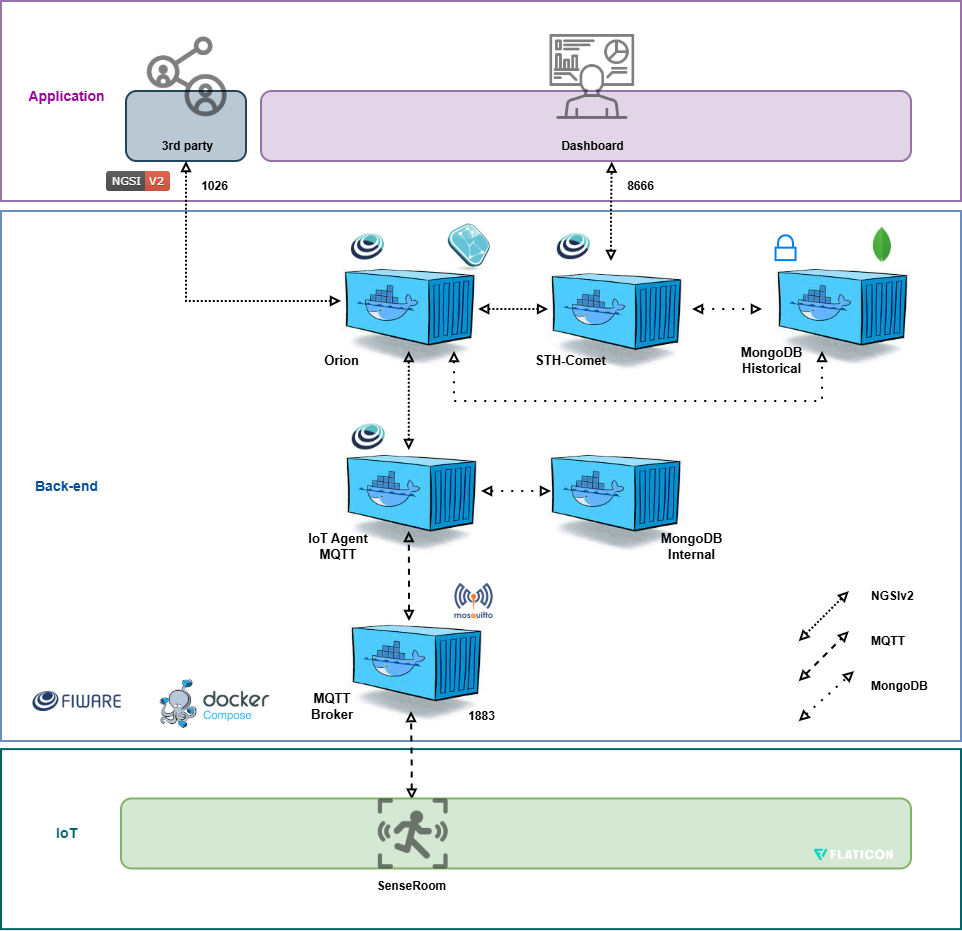

# SenseRoom
---
## Autores
- Antônio Jacinto de Andrade Neto (RM: 561777)
- Felipe Bicaletto (RM: 563524)
- Thayná Pereira Simões (RM: 566456)
---
## Descrição do projeto
Este projeto implementa um sistema de monitoramento inteligente de ambientes utilizando um ESP32, sensor PIR e microfone analógico para detectar presença e níveis de ruído em tempo real. Os dados são enviados via MQTT para plataformas IoT, permitindo integração com dashboards, sites ou aplicativos internos.

A solução foi pensada para resolver um problema comum em grandes empresas: a dificuldade de encontrar salas disponíveis e silenciosas para reuniões, foco ou gravações. Com a detecção automática de ocupação e ruído, a empresa passa a ter um mapa atualizado dos ambientes, permitindo que funcionários verifiquem rapidamente qual sala está vazia, silenciosa ou indisponível.

Ao facilitar o acesso à informação e reduzir o tempo perdido procurando ambientes adequados, o sistema contribui diretamente para aumentar a produtividade, melhorar a organização interna e otimizar o uso dos espaços corporativos.

---
## Arquitetura do projeto

### O sistema é composto por três camadas principais:
1. **Dispositivo IoT (ESP32)** 
 - Detecta presença através do sensor PIR.
 - Mede o nível de ruído com um microfone analógico.
 - Processa os dados e publica as informações em tópicos específicos no broker MQTT.
     - presença
     - nível de ruído

2. **Broker MQTT**  
   - Recebe os dados do ESP32 e distribui para os consumidores (ex.: FIWARE IoT Agent).  
   - IP configurável (ex.: `20.118.201.114`).

3. **FIWARE / STH-Comet / Dashboards**  
   - O **FIWARE IoT Agent** consome os dados do MQTT e os armazena no **STH-Comet**
   - Um dashboard em **Python Flask** conecta-se ao STH e exibe:  
     - Salas ocupadas ou livres em tempo real
     - Nível de ruído atual
     - Histórico para análise de uso e produtividade

---

## Como funciona
- O ESP32 coleta dados de presença (via sensor PIR) e nível de ruído (via microfone analógico), processa as leituras e publica as informações em tópicos MQTT. Essas informações podem ser usadas para identificar se uma sala está ocupada e se o ambiente está silencioso ou ruidoso.
- MQTT distribui os dados para o FIWARE IoT Agent, que registra os valores históricos.
- Dashboard em Flask consulta o STH-Comet para exibir o gráfico de ruído e a presença.

Link da Simulação Wokwi: https://wokwi.com/projects/447436494310112257

---
## Manual de instalaçõ em uma VM (Ubuntu Server)
### 1️. Pré-requisitos
- Ubuntu Server LTS (20.04 ou 22.04)
- Python 3.12 (ou superior)
- Pip instalado
- Porta 5000 liberada no firewall